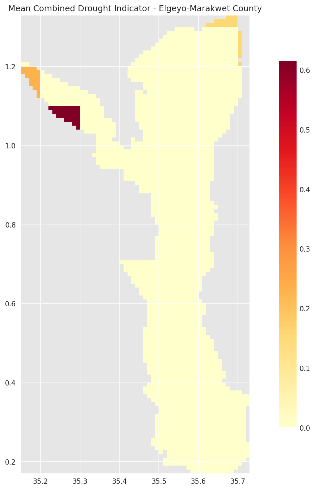
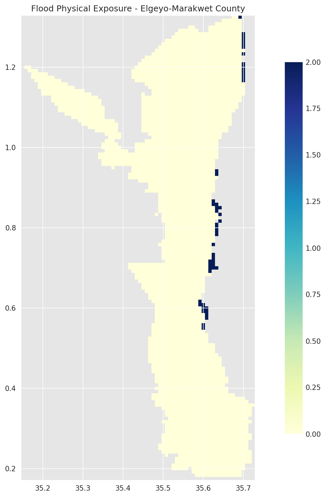
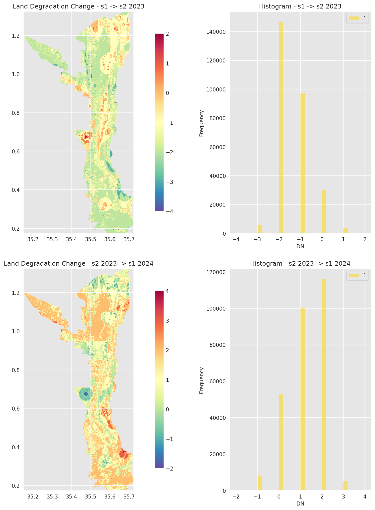
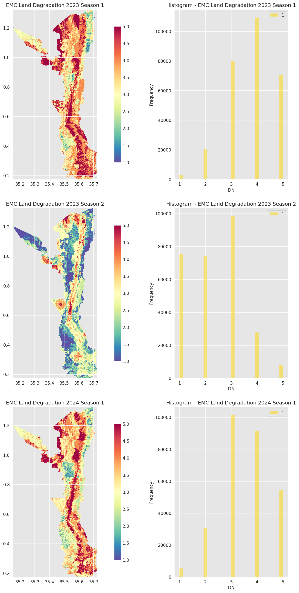

# Climate Risk Profile for Elgeyo-Marakwet County, Kenya

This repository contains the code and data for a comprehensive climate risk profile at Admin 3 levels for Elgeyo-Marakwet County in Kenya.

## Project Overview

This project focuses on developing an integrated climate risk profile for Elgeyo-Marakwet County in Kenya. The analysis includes:

1. Drought hazard exposure analysis
2. Flood hazard exposure analysis
3. Land degradation assessment
4. Integrated multi-hazard risk profiles at Admin 3 level

The analysis combines data from multiple sources, including:
- IGAD Combined Drought Indicator (CDI) data
- RCMRD Flood Physical Exposure data
- GMES Land Degradation data for multiple seasons

## Environment Setup

### Using uv (recommended)

This project uses `uv` for Python package management:

```bash
# Install uv if you don't have it
curl -sSf https://astral.sh/uv/install.sh | bash

# Sync the enviornment from uv.lock
uv sync
```

### Using pip

```bash
# Create a virtual environment
python -m venv .venv

# Activate the environment
source .venv/bin/activate  # Linux/Mac
# or
.venv\Scripts\activate     # Windows

# Install dependencies
pip install -r requirements.txt
```

## Project Structure

- `notebooks/`: Jupyter notebooks for exploratory data analysis and visualization
- `data/`: Storage location for raw and processed data
  - `01_raw/`: Raw input data from various sources
  - `02_intermediate/`: Cleaned and pre-processed data
  - `04_feature/`: Engineered features for analysis
  - `07_model_output/`: Final outputs and analysis results
- `src/`: Source code for the package
- `docs/`: Documentation and visualization outputs
  - `figures/`: Generated plots and visualizations
  - `kepler.gl.html`: Interactive geospatial visualization

## Data Sources

- IGAD Region Monthly Combined Drought Indicator (CDI) 2024-2025
- RCMRD Flood Physical Exposure data
- GMES Land Degradation data for Kenya (2023-2024)
- GADM Administrative Boundaries (v4.1)

## Analysis Workflow

1. **Data Collection**: Gathering data from various sources including Earth observation platforms
2. **Data Processing**: Cleaning, harmonizing, and preprocessing the data
3. **Feature Engineering**: Creating relevant indicators and metrics
4. **Spatial Analysis**: Computing statistics for each Admin 3 region
5. **Visualization**: Creating maps and plots to communicate findings
6. **Risk Profiling**: Developing integrated risk profiles for each region

## Requirements

This project requires Python 3.8+ and the following key libraries:
- geopandas
- rasterio
- matplotlib
- numpy
- pandas
- seaborn
- earthengine-api
- geemap

See `requirements.txt` for a complete list of dependencies.

## Visual Outputs

### Drought Risk Analysis

The Mean Combined Drought Indicator (CDI) shows areas with higher drought risk in the county:



### Flood Risk Analysis

The Flood Physical Exposure (FPE) map shows areas at risk of flooding:



### Land Degradation Analysis

The project includes land degradation tracking across multiple seasons and analysis of change:





### Multiple Hazard Profiles

The integrated hazard profiles combining drought, flood, and land degradation risks for Elgeyo-Marakwet County:


### Interactive Visualization

An interactive Kepler.gl visualization is available in `docs/kepler.gl.html` for exploring the geospatial data in detail.

## License

[MIT License](LICENSE)

## Contact

Maintainer: Christopher Chan
